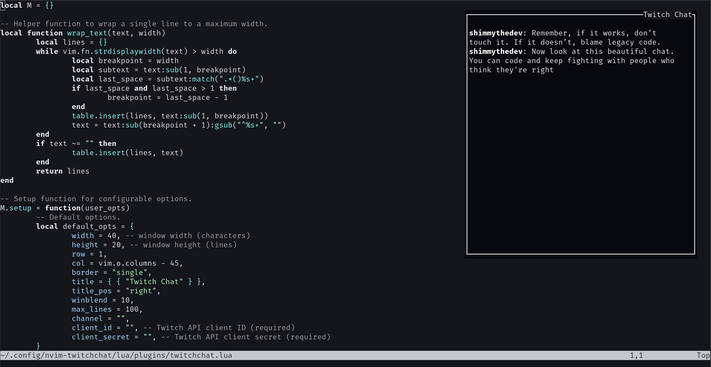

# nvim-twitchchat

**nvim-twitchchat** is a Neovim plugin that displays Twitch chat in a floating, transparent window. It leverages lazy.nvim for plugin management and uses LuaSocket, LuaSec, and lua-cjson to connect to Twitch’s IRC and OAuth API.



## Features

- **Floating Window:** Chat is displayed in a floating window with configurable transparency, dimensions, and position.
- **Rolling Buffer:** Automatically removes older messages to keep the visible chat within the window bounds.
- **Customizable Styling:** Configure nickname formatting (bold, transparency) and other UI options.
- **Configurable Options:** Easily override default settings (e.g. channel, window size, Twitch API credentials) in your lazy.nvim configuration.
- **Non-Intrusive:** The chat window never steals focus, letting you continue coding seamlessly.

## Requirements

- **Neovim 0.8+** (with Lua 5.1)
- **lazy.nvim** for plugin management

### Lua Dependencies

Install the following Lua modules using LuaRocks:

```bash
luarocks install luasocket
luarocks install luasec
luarocks install lua-cjson
```

## Installation

Add **nvim-twitchchat** to your lazy.nvim configuration. For example, in your `init.lua`:

```lua
require("lazy").setup({
  spec = {
    {
      "yourusername/nvim-twitchchat",  -- Replace with your GitHub repository
      config = function()
        require("plugins.twitchchat").setup({
          width = 50,            -- Window width in characters
          height = 25,           -- Window height in lines
          row = 1,
          col = vim.o.columns - 55,
          channel = "your_channel",  -- Default Twitch channel
          client_id = "your_client_id",         -- Twitch API client ID (required)
          client_secret = "your_client_secret", -- Twitch API client secret (required)
          max_lines = 150,       -- Maximum number of lines to keep in chat
          -- Add any other options here
        })
      end,
    },
  },
  defaults = { lazy = false },
})
```

Replace the placeholder values with your own Twitch API credentials and desired settings.

## Testing

For testing purposes, you can use the `nvim` command to run your plugin repository. Create an `init.lua` in your repository root with the following minimal configuration:

```lua
-- init.lua for testing nvim-twitchchat
local lazypath = vim.fn.stdpath("data") .. "/lazy/lazy.nvim"
if not vim.loop.fs_stat(lazypath) then
  vim.fn.system({
    "git",
    "clone",
    "--filter=blob:none",
    "--branch=stable",
    "https://github.com/folke/lazy.nvim.git",
    lazypath,
  })
end
vim.opt.rtp:prepend(lazypath)

require("lazy").setup({
  spec = {
    { import = "plugins" },
  },
  defaults = { lazy = false },
})
```

Then run:

```bash
nvim -u init.lua
```

Inside Neovim, execute `:TwitchChat` to open the chat window and test the functionality.

## Configuration Options

The following options are available in the plugin’s `setup` function:

- **width**: Window width in characters (default: 40)
- **height**: Window height in lines (default: 20)
- **row**: Window row position (default: 1)
- **col**: Window column position (default: `vim.o.columns - 45`)
- **border**: Border style (default: "single")
- **title**: Window title (default: `{ {"Twitch Chat"} }`)
- **title_pos**: Position of the title (default: "right")
- **winblend**: Transparency level for the window (default: 90)
- **max_lines**: Maximum number of buffer lines (default: 100)
- **channel**: Default Twitch channel (default: "shimmythedev")
- **client_id**: Twitch API client ID (required)
- **client_secret**: Twitch API client secret (required)

Users can override any of these defaults when setting up the plugin.

## Contributing

Contributions, bug reports, and feature requests are welcome! Please open an issue or submit a pull request.

## License

This project is licensed under the MIT License.

## ToDo

Emotes are not working yet.
